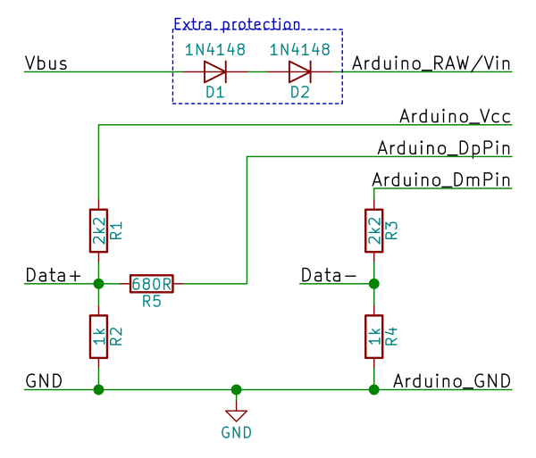

# QC2Control
Set the voltage of a Quick Charge 2.0 source via the Arduino.  
By Timo Engelgeer (Septillion)

All credit goes to [Hugatry's HackVlog](https://www.youtube.com/channel/UCHgeChD442K0ah-KxEg0PHw) because he came up with the idea and first code. I just made a nicer wrapper :p

## What does it do?
QC2Control makes it possible to set the voltage (even on the fly) of a Quick Charge 2.0 source like a mains charger or power bank. Possible voltages are 5V (USB default), 9V or 12V. The source needs to support the [Quick Charge 2.0](https://www.qualcomm.com/products/features/quick-charge) technology form [Qualcomm](https://www.qualcomm.com/) in order to work.

### How to connect?
All you need to use four resistors and (optionally) two diodes.


The wire color for a normal USB-cable is  
V<sub>BUS</sub>: Red  
Data+: Green  
Data-: White  
GND: Black

You're free to pick any pin on the Arduino, just be sure to point to the right pins in QC2Control().

R5 is optional if a 3,3V Arduino is used. With R5 you can use both 3,3V and 5 Arduino's to control the Quick Charge 2.0 source.

#### Diodes
Although the regulator on a Arduino Pro Mini should be able to handle 12V (with a light load) some clones don't like 12V and release the [magic smoke](https://en.wikipedia.org/wiki/Magic_smoke). Adding two diodes will drop the voltage slightly (+-1,5V) so the Arduino can handle the voltage, even if it's set to 12V.

Because the Arduino can only provide a small current the small and cheap 1N4148 will do. But any other (non-Schottky) should work like a 1N4007 etc.

## Download and install
### Library manager
QC2Control is available via Arduino IDE Library Manager.

1.  Open the Arduino IDE (1.5 or above).
2.  In the tool-bar click Sketch -> Include Library -> Manage Libraries...
3.  Type in the search bar "QC2Control".
4.  The latest version of QC2Control should show.
5.  Click on it and click Install.
6.  Done!

### GitHub
Latest release: **[v1.0.0](https://github.com/septillion-git/QC2Control/archive/v1.0.0.zip)**

1. Download the latest release.
2. Extract it to the `libraries` folder **inside** your Sketchbook. Default is `[user]\Arduino\libraries`. 
3. Rename the folder to `QC2Control` (remove version number).
4. Restart the Arduino IDE if you had it open.
5. Done!

### Update
You can update to the latest version of the library in the Library Manager as well. 

1.  Open the Arduino IDE (1.5 or above).
2.  In the tool-bar click Sketch -> Include Library -> Manage Libraries...
3.  Type in the search bar "QC2Control".
4.  The QC2Control library should show.
5.  **Click on it** and click Update.
6.  Done!

Alternatively you can download it from GitHub and simply unpack it over the current version (or remove the old version first).

## Usage
Just see this simple sketch
```C++
#include <QC2Control.h>

//Pin 4 for Data+
//Pin 5 for Data-
//See How to connect in the documentation for more details.
QC2Control quickCharge(4, 5);

void setup() {
  //Optional
  //quickCharge.begin();

  //set voltage to 12V
  quickCharge.set12V();
  //Same as
  //quickCharge.setVoltage(12);

  delay(1000);
}

void loop() {
  //And you can change it on the fly
  delay(1000);
  quickCharge.setVoltage(9);
  delay(1000);
  quickCharge.setVoltage(5);
  delay(1000);
  quickCharge.setVoltage(12);
}
```
**Please note**, delay() here is just used to demonstrate. Better not to stop the complete program with delay()'s.

If you can, place the call to begin() (or setVoltage()) at the end of the setup(). The handshake needs a fixed time but that already starts when the QC 2.0 source (and thus the Arduino) is turned on. So by doing begin() last you can do stuff while waiting.

### Methods
#### QC2Control(byte DpPin, byte DmPin)
Alright, not a method but the constructor. This will create a QC2Control-object to control the voltage of the Quick Charge 2.0 source. DpPin is the pin number for the Data+ side and DmPin is the pin number for the Data- side. See [**How to connect?**](#how-to-connect).

#### void .begin()
Just does the handshake with the Quick Charge 2.0 source so it will accept commands for different voltage. It's not mandatory to call begin(), if it's not called before setting a voltage the library will call begin() at that moment.

#### void .setVoltage(byte volt), .set5V(), .set9V() and .set12V()
Will simply set the voltage. Setting a different voltage than 5V, 9V or 12V with setVoltage() will result in a "save" 5V

#### byte getVoltage()
Return the last voltage that was set, so it will either 5, 9 or 12.

## Full documentation
Full documentation of all the methods of this library can be found inside the library located in `QC2Control\doc`. Just open `QC2Control\doc\index.html` to see all methods of QC2Control. 

You can also view the documentation via [GitHub HTML Preview](https://htmlpreview.github.io/?https://github.com/septillion-git/QC2Control/blob/v1.0.0/doc/index.html).

This documentation is powered by [Doxygen](http://www.doxygen.org/) and thus fully extracted from the source files. This README.md is also used as Main Page.

## FAQ

### Can I control more the one Quick Charge source with a single Arduino?
Yes you can! Just make multiple QC2Control objects connected to different pins. But be sure to connect GND of all power supplies (including QC2.0 sources) together but **not** the voltage rails.